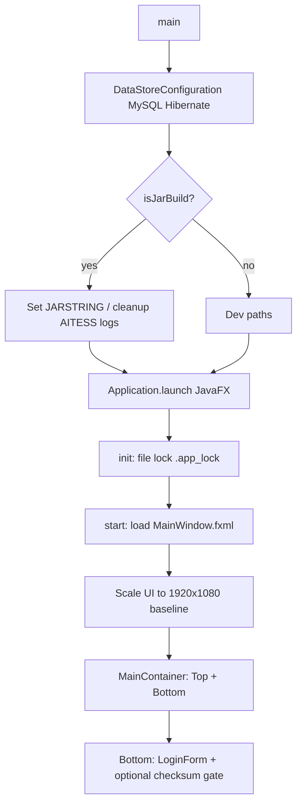
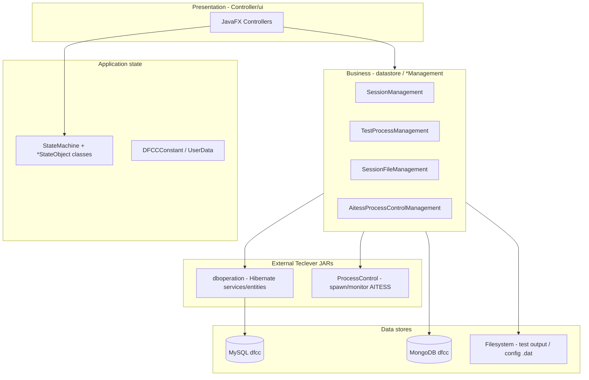
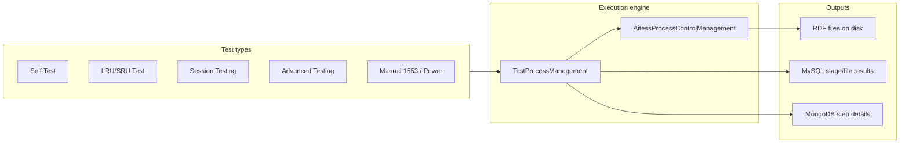

# BEL-DFCC — Project Understanding

> **Purpose:** Agent-maintained overview of the codebase after exploration (May 2026).  
> **Product title (UI):** *DFCC TESTING AND DATA HANDLING SOFTWARE*  
> **Organization:** Teclever (`com.teclever.dfcc`) — appears to be built for **BEL** (Bharat Electronics Limited) DFCC (Digital Flight Control Computer) test and data handling.

---

## 1. What this application does

BEL-DFCC is a **desktop JavaFX application** used on the test floor to:

1. **Configure** test infrastructure (AITESS runners, OFP versions, stages, macros, symbols, run paths, fault codes, VDD, cPCI cards).
2. **Create and run test sessions** against **UUTs** (Units Under Test) with hierarchical **stages** and **test files** (often `.rdf` result definition files).
3. **Drive external test processes** (AITESS 1/2 via `ProcessControl.jar`) and parse live output (temperature, channel status, PBIT, WDM, etc.).
4. **Store structured results** in **MySQL** (session metadata, stage status, file mappings) and **MongoDB** (detailed RDF/step-level result documents).
5. **Analyze, report, and back up** test data (PDF/Excel reports, dashboards, advanced data analysis, deviation/cumulative views).

It is not a web app; it is an **Eclipse/Maven** project intended to run as a **single instance** (file lock) on a Windows test station connected to hardware/software under test.

---

## 2. Technology stack

| Layer | Technology |
|--------|------------|
| Language | Java (compiler target **1.8** in `pom.xml`; Eclipse `.classpath` references **Java 16**) |
| UI | **JavaFX 21** (OpenJFX in Maven; local `Jars/javafx.*.jar` for Eclipse) |
| UI layout | Mix of **programmatic Java** (most screens) + **25 FXML** popups under `ui/fxml/` |
| Primary DB | **MySQL** `jdbc:mysql://localhost:3306/dfcc` via **Hibernate 6** (`DataStoreConfiguration` in `Main.java`) |
| Result detail DB | **MongoDB** `localhost:27017`, database `dfcc` (`ResultStoreConnection`, `mongoDbConnection1.jar`) |
| PDF / docs | iText 5, html2pdf, Apache POI, OpenCSV |
| Security | Spring Security Crypto, jBCrypt (password handling) |
| External binaries | `Jars/dboperation.jar`, `Jars/ProcessControl.jar` (Teclever shared libraries — entities/services live in `com.teclever.datastore.*`) |

**Build:** Maven `pom.xml` (`DFCCBEL` / `0.0.1-SNAPSHOT`) + Eclipse project metadata (`.classpath`, `.settings`). Source root: `src/`.

---

## 3. Repository layout (high level)

```
BEL-DFCC/
├── src/
│   ├── com/teclever/dfcc/          # Application source (~400+ Java files)
│   │   ├── Main.java               # Entry: DB init, JavaFX launch, single-instance lock
│   │   ├── DFCCConstant.java       # Global flags, UUT maps, session/test state helpers
│   │   ├── Controller/ui/          # JavaFX controllers (largest package)
│   │   ├── datastore/              # Business logic: sessions, files, config, process control
│   │   ├── stateMachine/           # Test lifecycle & live session state (JavaFX properties)
│   │   ├── resultstore/            # Mongo RDF parsing & result DTOs
│   │   ├── reportgeneration/       # PDF/report builders
│   │   ├── advanceddataanalysis/   # Post-test analysis (1553, power, deviation, etc.)
│   │   ├── dashboard/              # Production/temperature dashboard data
│   │   ├── buildconfiguration/     # Build config fetch/report
│   │   ├── model/                  # UI/table model beans
│   │   ├── utils/                  # Notifications, tables, checksum, debug
│   │   └── ui/css/, ui/fxml/       # Stylesheets and popup FXML
│   └── Resources/Images/           # Logos, menu icons, backgrounds
├── Jars/                           # Local dependencies (JavaFX, MySQL, dboperation, ProcessControl, …)
├── Resources/                      # Additional runtime images
├── target/                         # Compiled output (when built)
├── pom.xml
└── README.md                       # Minimal ("# BEL-DFCC")
```

**Note:** Many `.bak` files and untracked upload paths (`null/upload/…`) exist in the working tree — treat as local/dev artifacts, not core architecture.

---

## 4. Application startup flow



**`Main.java` responsibilities:**

- Configure Hibernate against MySQL database `dfcc`.
- Enforce **single running instance** via `.app_lock`.
- Load `MainWindow.fxml` → `MainWindowController` / `MainContainerController`.
- Apply display scaling from actual screen size vs 1920×1080.
- On close: confirm exit, block if tests running, log logout to application logbook, copy session files via `SessionFileManagement.copyingFileWhileLogOut`.

**`DFCCConstant.JARSTRING`:** Prefix for classpath resources (`""` in IDE, `"/src"` when `isJarBuild` is true) so CSS/FXML/images resolve in JAR vs dev layouts.

---

## 5. UI architecture

### Shell

| Component | Role |
|-----------|------|
| `MainWindow.fxml` | Nearly empty `AnchorPane`; real UI built in code |
| `MainContainerController` | Top 15% + bottom 85% grid |
| `TopContainerController` | Header/status before login |
| `BottomContainerController` | Background image + `LoginFormController` |
| `LoginFormController` | Authentication, checksum validation overlay, routes to admin or user shell |
| `AdminDashboardController` | Left tree menu + `AdminCenterContentController` (config screens) |
| `UserDashboardController` | Left tree menu + `UserCenterContentController` (testing/operations) |

Most screens are **built with `GridPane` / `TreeView` / `TableView` in Java**, not FXML. FXML is reserved for smaller dialogs (Add User, OFP load, PBIT, terminal popup, data backup, etc.).

### Styling

- Per-screen CSS under `src/com/teclever/dfcc/ui/css/` (50+ files).
- Resources loaded with `getClass().getResource(DFCCConstant.JARSTRING + "/com/teclever/dfcc/ui/css/…")`.

---

## 6. User roles and navigation

Login is handled in `LoginFormController` → `UserManagementModule`. Role IDs drive which dashboard loads:

| Role ID | Typical name (in code) | Dashboard | Capabilities (summary) |
|---------|------------------------|-----------|-------------------------|
| `RL_ID_1` | BEL Admin | **Admin** | Full configuration: users, VDD, fault codes, AITESS/OFP/stage/macro/cPCI, utilities |
| `RL_ID_2` | BEL User *or* Squadron Admin (mappings differ between `AddUserController` and `UserManagementController`) | **Admin** (limited menu for RL_ID_2) | User management (partial) |
| `RL_ID_3` | Squadron Admin / BEL User (see note below) | **User** | Dashboard, LRU config, testing (self/LRU/session/advanced), results, data analysis, reports |
| `RL_ID_4` | Squadron User | **User** (reduced) | Dashboard, testing (self/LRU/OFP load only), results, limited reports |

**Important:** Role label → ID mappings are **not fully consistent** across `UserManagementController` and `AddUserController`. Operational behavior should always be verified against `UserData.getRoleId()` checks in controllers, not display names alone.

**User dashboard — Testing menu (`RL_ID_3`):**

- Default: Self Test, SRU/LRU Test, **Session Testing**, Advanced Testing.
- If `currentSessionDetails.getSessionTypeID()` equals `"ST4"`: Trials Config / Trials Testing replace session testing.

**User dashboard — Testing menu (`RL_ID_4`):**

- Self Test, SRU/LRU Test, **OFP-Loading** only (no full session/advanced suite).

---

## 7. Domain concepts

| Term | Meaning in this codebase |
|------|---------------------------|
| **DFCC** | Digital Flight Control Computer under test; variants **MK1**, **MK1A**, **MK2** (`DFCCConstant.MARK1/1A/2`) |
| **UUT** | Unit Under Test — identified by UUT ID/type from master data |
| **Session** | A test campaign for a UUT (serial number, stages, timing, status); ID like `SASN00010` |
| **Stage** | Hierarchical test phase (up to 5 levels in DB entities `LevelOneStageMaster` … `LevelFiveStageMaster`) |
| **RDF** | Result definition file; parsed for steps, faults, SRUs (`StepParser`, `RdfFileDetailsParser`) |
| **AITESS** | External automated test environment (two instances: aitess1/aitess2) controlled via `ProcessControl` |
| **OFP** | Operational Flight Program — separate config track from AITESS (versions, test/symbol/macro files) |
| **LRU / SRU** | Line Replaceable / Shop Replaceable Unit testing flows |
| **Run configuration** | Maps test execution to filesystem paths for RDF/TPF outputs |
| **Build configuration** | Tracks build IDs, versions, dates for unit configuration reporting |
| **Macro / Symbol files** | `.mac` / `.sym` assets driving custom and interface tests |
| **PBIT** | Power-on built-in test flows with OFP selection popups |
| **WDM** | Status tracked in state machine during AITESS runs |

---

## 8. Layered architecture (logical)



### `stateMachine` package

Central **reactive application state** for long-running tests:

- `TestState`: PENDING, RUNNING, PAUSED, STOPPED, COMPLETED
- `RunningTestName` / `StatusBarTestName`: SELF_TEST, SESSION_TEST, LRU_SRU_TEST, ADVANCED_TEST variants
- `currentSessionDetails`: UUT, session, stage, serial numbers (JavaFX-friendly holders)
- Specialized state objects: `SessionTestStateObject`, `SelfTestStateObject`, `LRUTestStateObject`, `AdvancedTestStateObject`
- Channel temperature maps, online/power/OFP/WDM status flags

UI binds to these properties for status bars, enable/disable of play/pause/stop, and safe shutdown.

### `datastore` package (main business logic)

| Subpackage | Responsibility |
|------------|----------------|
| `sessionmanagement` | Session CRUD, stage trees, trials, remarks, timing — large `SessionManagement.java` (~4000+ lines) |
| `testmanagement` | Orchestrates test file execution, RDF parsing hooks, result persistence |
| `processcontrolmanagement` | AITESS process lifecycle, queues, log parsing, channel checks |
| `filemanagement` | Session folders, symbol/macro/test plan files, checksums, downloads, system config |
| `configurationmanagement` | AITESS, OFP, run paths, stages, macros, reports |
| `customtestmanagement` | Advanced custom1/custom2, HWATP, interface tests |
| `usermanagement` | Login, password change, user CRUD |
| `logbookmanagement` | Application and UUT logbook entries |
| `terminalmanagement` | Driver load, channel status parsing |
| `dto` | 100+ transport objects between UI and services |

### `resultstore` package

- `ResultStoreConnection` → MongoDB `dfcc` database.
- `RdfFileDetailsParser.saveProjectDetailsToMongoDB` stores rich RDF analysis linked from MySQL `systemResultInfoId`.
- `StepParser` / `ResultManagement` for step-level DTOs.

### `reportgeneration` package

Generates **PQT**, **ESS**, **Datapack**, **History** reports (PDF/Excel combinations), uses iText and POI. Controllers: `ReportController`, `ViewReportController`, `ReportsUploadController`, `DataBackupPopupController`.

### `advanceddataanalysis` package

Post-run analytics: unit details, 1553-B data, power manual/auto, filters, deviation, cumulative results — paired with newer controllers (`DeviationController`, `CumulativeController`, filter table controllers).

### `dashboard` package

Production metrics, temperature channels, file upload (`DashboardFileUpload`, `SQDashboardController`, `BlsTemperatureController`).

---

## 9. Test execution paths (conceptual)



**Session testing** typically:

1. User selects/creates session and stages (`SessionCreationController`, `StageConfigurationController`).
2. Play triggers file copy to output folders (`SessionFileManagement`) and sequential test file execution.
3. `TestProcessManagement` launches/monitors processes, parses RDF, updates stage status, writes Mongo reference IDs.
4. Results UI (`CurrentExecutionResultController`, `CurrentStageResultController`, etc.) reads aggregated DTOs.

**Advanced testing** submodes (from `StateMachine.StatusBarTestName`):

- HWATP/HSI, Interface, Custom1, Custom2 — each has dedicated controller + `*TestingManagement` class.

---

## 10. Configuration and filesystem

- **`SystemConfigManagement`:** Encrypted `SystemConfig.dat` (path: JAR directory when packaged, else `C:\config\systemconfig.dat` in dev). Holds paths, feature flags, validation inputs for checksum gate at login.
- **`DFCCConstant.isJarBuild`:** Toggles resource prefix and config location behavior.
- **Session output trees:** Under configurable run/build paths; logout copies/archives via `LogOutFileCopyResponse`.
- **AITESS directories:** Resolved under user home / configured paths in `AitessProcessControlManagement` (`aitessDir`, `aitess1Dir`, config files, startup user files).

---

## 11. Key entry classes (quick reference)

| Class | Purpose |
|-------|---------|
| `com.teclever.dfcc.Main` | Application entry |
| `com.teclever.dfcc.DFCCConstant` | Global static state |
| `com.teclever.dfcc.UserData` | Logged-in user session fields |
| `com.teclever.dfcc.stateMachine.StateMachine` | Test/session runtime state |
| `com.teclever.dfcc.datastore.sessionmanagement.SessionManagement` | Session/stage domain API |
| `com.teclever.dfcc.datastore.testmanagement.TestProcessManagement` | Test run orchestration |
| `com.teclever.dfcc.datastore.processcontrolmanagement.AitessProcessControlManagement` | External process control |
| `com.teclever.datastore.configuration.DataStoreConfiguration` | Hibernate bootstrap (external JAR) |

---

## 12. Dependencies outside this repo

The following are **not fully source-visible** in BEL-DFCC but are required at runtime:

1. **`dboperation.jar`** — Hibernate entities (`com.teclever.datastore.entities.*`), services (`*Service`), generic `Response` DTOs.
2. **`ProcessControl.jar`** — `com.teclever.utils.ProcessControl` for spawning/interacting with AITESS executables.
3. **`mongoDbConnection1.jar`** — `dbConnection.DBConnection` wrapper for Mongo client.

Understanding any DB schema change starts in those JARs or their source projects, not only in BEL-DFCC.

---

## 13. Development observations

1. **Dual build paths:** Eclipse uses `Jars/*.jar`; Maven pulls overlapping deps from Central — keep versions aligned when troubleshooting classpath issues.
2. **Java version drift:** `pom.xml` targets 1.8; Eclipse uses Java 16 — may hide compatibility issues until CI enforces one JDK.
3. **UI pattern:** Large controller classes (e.g. `UserDashboardController` 3000+ lines) mix layout, event handling, and business calls — refactors should be done carefully.
4. **Global mutable state:** `DFCCConstant` and `StateMachine` static fields are heavily used — concurrency and testability depend on disciplined UI-thread usage (`Platform.runLater`).
5. **Role ID mapping inconsistency:** Document and fix in a dedicated task before changing authorization behavior.
6. **Credentials in source:** `Main.java` embeds default MySQL credentials (`root`/`root`) — environment-specific configuration would be safer for deployment docs.
7. **Active development areas** (from git status): advanced data analysis filters, dashboard uploads, cumulative/deviation, build configuration popups, SQ dashboard, link test types.

---

## 14. How to run (developer)

**Prerequisites:** MySQL (`dfcc` schema), MongoDB (`dfcc` DB), local config/`SystemConfig.dat`, AITESS tooling installed per site procedures.

**Eclipse:** Import as existing project, ensure `Jars/*` on classpath, run `com.teclever.dfcc.Main` as Java Application with JavaFX VM args if needed.

**Maven:** `mvn compile` from project root; JavaFX modules may need `javafx:run` plugin or manual module path — project is primarily Eclipse-oriented today.

Set `DFCCConstant.isJarBuild = true` when testing packaged JAR layout and resource paths.

---

## 15. File counts (approximate)

| Area | Java files (approx.) |
|------|----------------------|
| `Controller/ui` | 111 |
| `datastore/dto` | 102 |
| `model` | 44 |
| `datastore/filemanagement` | 16 |
| `advanceddataanalysis` | 15 |
| Other packages | remainder (~100) |

**Total:** ~400 Java sources under `src/com/teclever/dfcc/`.

---

*This document reflects static analysis of the repository. For deployment-specific paths, hardware wiring, and AITESS install steps, refer to site/integration documentation outside this repo.*
